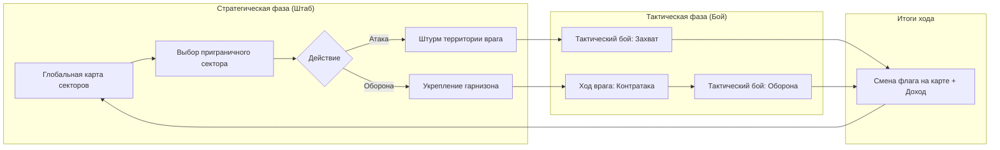

# Концепция: Захват территорий и редизайн UI/UX в стиле *Hogs of War*

Отказываемся от боссов, гринда и разбора оружия. Игра трансформируется в **пошаговую военно-стратегическую кампанию по захвату и обороне территорий** («Битва за Картофельный Остров»), совмещающую глобальную карту театра военных действий и пошаговые артиллерийские бои взводов картошки.

---

## 1. Геймдизайн: Глобальная карта и механика территорий

### 1.1. Структура глобальной карты
Карта представляет собой архипелаг/остров, разделенный на **16–20 взаимосвязанных секторов** (провинций), разбитых на 4 климатических региона:
1. **Прибре
<truncated 14930 bytes>
в (Синий/Красный), уровней защиты и иконок тревоги атаки.
* **Инспектор сектора**:
  * Всплывающая панель разведданных при клике на сектор.
  * Кнопки «В АТАКУ!» и «УКРЕПИТЬ».

### Спринт 3: Редизайн боевого HUD и режим обороны
* **Переработка `gui/hud/hud.gui` и `gui/hud/hud.gui_script`**:
  * Добавление динамического виджета ветра (интеграция с физикой полета снарядов в `physics_sim.lua`).
  * Новый компактный блок арсенала с отображением патронов и индикацией активного оружия.
  * Виджет бойцов отряда и индикатор фазы (Штурм / Оборона).
* **Специфика оборонительного боя**:
  * При обороне стартовые позиции Синих располагаются на возвышенностях с фортификациями (дополнительные укрытия из мешков/бункеров).

### Спринт 4: Военная сводка и полишинг
* **Редизайн `gui/game_over/game_over.gui`**:
  * Оформление в стиле военного дебрифинга с анимацией обновления карты фронта.
* **Звуки и эффекты**:
  * Сирена вражеской контратаки, звук смены флага, маршевые акценты победы/поражения.

---

Если концепция и структура утверждены, начнем реализацию с **Спринта 1** — создадим модуль структуры территорий и графа карты (`lua_modules/territory_map.lua`) с последующим переходом к интерфейсу глобальной карты!