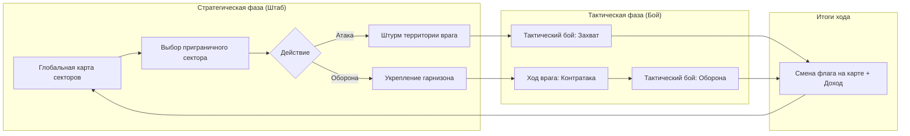
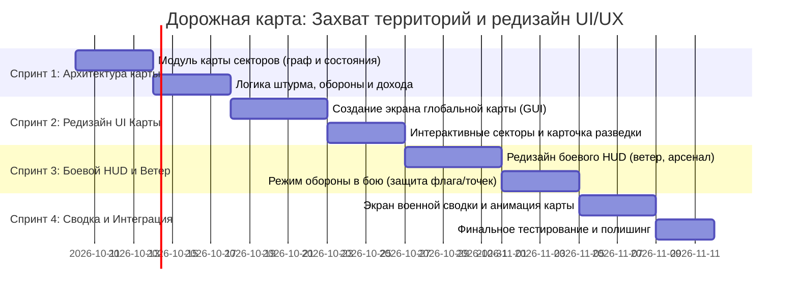

# Концепция: Захват территорий и редизайн UI/UX в стиле *Hogs of War*

Отказываемся от боссов, гринда и разбора оружия. Игра трансформируется в **пошаговую военно-стратегическую кампанию по захвату и обороне территорий** («Битва за Картофельный Остров»), совмещающую глобальную карту театра военных действий и пошаговые артиллерийские бои взводов картошки.

---

## 1. Геймдизайн: Глобальная карта и механика территорий



### 1.1. Структура глобальной карты
Карта представляет собой архипелаг/остров, разделенный на **16–20 взаимосвязанных секторов** (провинций), разбитых на 4 климатических региона:
1. **Прибрежные Луга (Зеленые Холмы)** — плацдарм высадки Синих (стартовые 2 сектора игрока).
2. **Пустынный Каньон (Песчаные Дюны и Мосты)** — центральный транспортный узел.
3. **Ледяной Перевал (Парящие Острова и Лед)** — высокогорные укрепления.
4. **Вулканические Бастионы (Катакомбы и Бункеры)** — генеральный штаб и цитадель Красных.

У каждого сектора на карте есть параметры:
* **Владелец**: 🔵 Синие (Игрок) / 🔴 Красные (Враг).
* **Связи (Границы)**: атаковать можно только секторы, граничащие с уже захваченными (линия фронта).
* **Уровень обороны (Fortification 1–3)**:
  * *Ур. 1 (Полевой лагерь)*: 1–2 защитника, базовый рельеф.
  * *Ур. 2 (Укрепленный форпост)*: 2–3 защитника + баррикады/бочки TNT на старте.
  * *Ур. 3 (Бункерная цитадель)*: 3–4 элитных защитника + пулеметные гнезда/укрытия.
* **Стратегический ресурсный доход (за ход)**:
  * 🌾 *Снабжение (Мешки с картошкой)*: очки найма подкреплений и ремонта укреплений.
  * 📦 *Арсенал*: бесплатные патроны для спецоружия (снаряды базуки, буры, дымовые шашки).

---

### 1.2. Механика постепенного захвата и обороны

#### А. Захват (Штурм вражеского сектора):
* Игрок выбирает подсвеченный приграничный сектор Красных.
* Задача: уничтожить гарнизон сектора за отведенное время раунда.
* **Результат победы**:
  * Сектор переходит под флаг Синих с базовым Уровнем обороны 1.
  * Линия фронта сдвигается вглубь острова, открывая доступ к новым секторам.
  * Игрок получает мгновенный трофей припасов.

#### Б. Оборона территории (Контратаки врага):
* Красные — не статичные мишени. После каждого хода игрока наступает **Фаза Контрудара Противника**:
  * ИИ выбирает один из уязвимых приграничных секторов игрока и объявляет **Штурм**.
  * Сектор на глобальной карте начинает пульсировать сиреной тревоги: `⚠️ ВРАГ АТАКУЕТ [НАЗВАНИЕ СЕКТОРА]!`.
* Игрок проводит **Оборонительный бой (Defense Mission)**:
  * Игрок обороняет высоты или стратегический командный пункт/склад припасов.
  * **Если игрок победил**: контратака отбита, сектор получает бонус к защите, враг отступает.
  * **Если игрок проиграл**: сектор теряет 1 уровень обороны (если уровень был 1 — сектор захватывают Красные, и фронт откатывается назад).

#### В. Укрепление (Fortify):
* Игрок может потратить ресурсы снабжения, чтобы не атаковать на этом ходу, а **повысить уровень защиты** своего приграничного сектора (поставить бункеры, расставить ящики с боеприпасами).

---

## 2. Полный редизайн UI и UX

Текущий интерфейс содержит разрозненные элементы из аркадного прототипа. Переделываем его в строгий, атмосферный и читаемый **военно-тактический стиль (Military Potato Command)**:

```
┌────────────────────────────────────────────────────────────────────────┐
│ [★ КАРТА ВОЙНЫ]  Секторы: 7/18 (39%)      Припасы: 450 🥔   Ход: 12   │
├──────────────────────────────────────────────────────┬─────────────────┤
│                                                      │ [СЕКТОР #08]    │
│            (ИНТЕРАКТИВНАЯ КАРТА ОСТРОВА)             │ "Северный Мост" │
│                                                      │ Владелец: 🔴    │
│      [ Луга ] ─── [ Холмы ] ─── [ Каньон ]           │ Защита: ★★☆     │
│        (🔵)           (🔵)          (🔴) ⚠️          │ Гарнизон: 3     │
│         │               │             │              │ Доход: +35/ход  │
│      [ Побережье ] ─ [ Долина ] ─ [ Бункер ]         ├─────────────────┤
│        (🔵)           (🔴)          (🔴)             │ [⚔️ В АТАКУ!]   │
│                                                      │ [🛡️ УКРЕПИТЬ]   │
└──────────────────────────────────────────────────────┴─────────────────┘
```

### 2.1. Экран 1: Глобальная карта кампании (`gui/campaign_map/`)
1. **Визуализация театра военных действий**:
   * Остров с четкими многоугольными секторами.
   * Цветовое кодирование: Синяя зона (контроль игрока), Красная зона (оккупация врага), нейтральные/серые буферные зоны.
   * Яркая анимированная линия фронта (красно-синий пунктир).
   * Иконки флагов и уровней защиты (1–3 шеврона/звезды) на каждом секторе.
   * Анимированная пульсация тревоги над секторами, находящимися под атакой.
2. **Панель штаба (Сверху)**:
   * Прогресс войны (например, `Захвачено: 8 из 18 провинций`).
   * Текущие ресурсы снабжения (`Припасы: 1,250 🥔`).
   * Кнопка «Сводка фронта» и быстрые настройки.
3. **Карточка разведки сектора (Справа/снизу при клике на сектор)**:
   * Название сектора, мини-арт рельефа (Каньон, Архипелаг, Бункеры).
   * Разведданные: численность гарнизона, тип рельефа, погодные условия (ветер).
   * Кнопка **«В АТАКУ!»** (активна, если есть смежная территория) либо **«УКРЕПИТЬ»** (для своих секторов).

---

### 2.2. Экран 2: Боевой тактический HUD (`gui/hud/`)
Редизайн боевого интерфейса с упором на эргономику, тактику и управление артиллерией:

```
┌────────────────────────────────────────────────────────────────────────┐
│ [🔵 ОТРЯД: 3/3]   ◄ 14с ► [ОБОРОНА: СЕКТОР 04]   [ВЕТЕР: ──► 18 м/с]   │
├────────────────────────────────────────────────────────────────────────┤
│                                                                        │
│                          (ИГРОВОЕ ПОЛЕ БОЯ)                            │
│                                                                        │
├────────────────────────────────────────────────────────────────────────┤
│ [1.Боец HP:95] [2.Снайпер HP:60]  │ [ 💣 ГРАНАТА ] [ 🚀 БАЗУКА (3) ]   │
│ [⇦ НАЗАД] [ВПЕРЕД ⇨]  [ ▲ ПРЫЖОК ] │ [ 🗡️ НОЖ (4) ] [ 🎯 ВИНТОВКА (2) ] │
└────────────────────────────────────────────────────────────────────────┘
```

1. **Верхний тактический бар**:
   * **Статус битвы**: Название сектора + Режим (`ШТУРМ СЕКТОРА` или `ОБОРОНА РУБЕЖА`).
   * **Флюгер ветра**: крупная динамическая стрелка и цифровое значение силы ветра (критично для навесной стрельбы).
   * **Таймер хода**: крупный круговой или полосковый индикатор времени с цветовой градацией (Зеленый -> Желтый -> Пульсирующий красный на последних 5 секундах).
2. **Нижний блок отряда и перемещения (Слева)**:
   * Иконки бойцов отряда с текущим HP и маркером активного бойца.
   * Кнопки перемещения влево/вправо и прыжка с увеличенной зоной нажатия (Touch/Mouse-friendly).
3. **Тактический арсенал (Справа)**:
   * Сетка быстрого выбора оружия 2x3 с понятными пиктограммами и счетчиками оставшихся патронов.
   * Выбранное оружие четко выделяется неоновой рамкой.

---

### 2.3. Экран 3: Военная сводка и дебрифинг (`gui/game_over/`)
* Вместо банального «You Win / Game Over»:
  * **Победа в атаке**: «СЕКТОР ОСВОБОЖДЕН! Флаг Синих поднят над [Сектором]». Показывается мини-карта, на которой сектор перекрашивается из красного в синий, сдвигая линию фронта.
  * **Успешная оборона**: «АТАКА ОТБИТА! Враг понес тяжелые потери и отступил». Сектор сохраняется за игроком, начисляются припасы.
  * **Поражение в обороне**: «СЕКТОР ПОТЕРЯН! Вражеские силы заняли [Сектор]». Сектор перекрашивается в красный цвет.
* Кнопка «ВЕРНУТЬСЯ В ШТАБ» с плавным переходом к глобальной карте.

---

## 3. План технической реализации (Пошаговый Roadmap)



### Спринт 1: Логика карты и механика территорий
* **Создание модуля `lua_modules/territory_map.lua`**:
  * Описание структуры секторов: `id`, `name_ru/en`, `region`, `owner` (Blue/Red), `neighbors` (список соседних секторов), `defense_level` (1..3), `income`, `terrain_preset`, `biome`.
  * Методы: `get_available_targets()`, `capture_sector(id)`, `fortify_sector(id)`, `get_income()`.
* **Создание модуля `lua_modules/strategic_campaign.lua`**:
  * Управление ходом кампании: расчет фазы игрока -> сбор дохода -> выбор цели -> запуск боя.
  * Алгоритм ИИ контратак: выбор уязвимого пограничного сектора Синих для ответного удара Красных.
  * Сохранение состояния карты в `lua_modules/player_profile.lua` (персистентный прогресс кампании).

### Спринт 2: Интерфейс глобальной карты (`gui/campaign_map/`)
* **Создание GUI-экрана карты**:
  * Отрисовка карты острова и интерактивных узлов секторов с привязкой к координатам экрана (960x540).
  * Отображение соединяющих линий границ и линии фронта.
  * Индикаторы флагов (Синий/Красный), уровней защиты и иконок тревоги атаки.
* **Инспектор сектора**:
  * Всплывающая панель разведданных при клике на сектор.
  * Кнопки «В АТАКУ!» и «УКРЕПИТЬ».

### Спринт 3: Редизайн боевого HUD и режим обороны
* **Переработка `gui/hud/hud.gui` и `gui/hud/hud.gui_script`**:
  * Добавление динамического виджета ветра (интеграция с физикой полета снарядов в `physics_sim.lua`).
  * Новый компактный блок арсенала с отображением патронов и индикацией активного оружия.
  * Виджет бойцов отряда и индикатор фазы (Штурм / Оборона).
* **Специфика оборонительного боя**:
  * При обороне стартовые позиции Синих располагаются на возвышенностях с фортификациями (дополнительные укрытия из мешков/бункеров).

### Спринт 4: Военная сводка и полишинг
* **Редизайн `gui/game_over/game_over.gui`**:
  * Оформление в стиле военного дебрифинга с анимацией обновления карты фронта.
* **Звуки и эффекты**:
  * Сирена вражеской контратаки, звук смены флага, маршевые акценты победы/поражения.

---

Если концепция и структура утверждены, начнем реализацию с **Спринта 1** — создадим модуль структуры территорий и графа карты (`lua_modules/territory_map.lua`) с последующим переходом к интерфейсу глобальной карты!